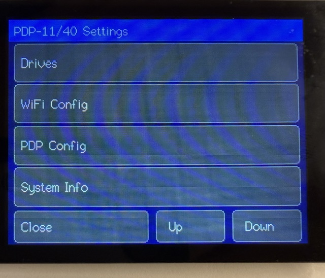
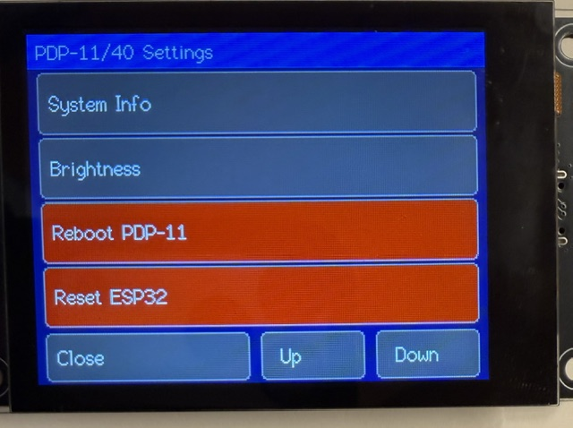
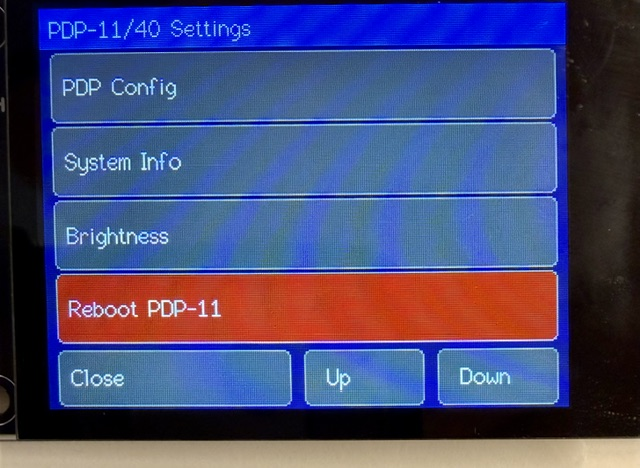
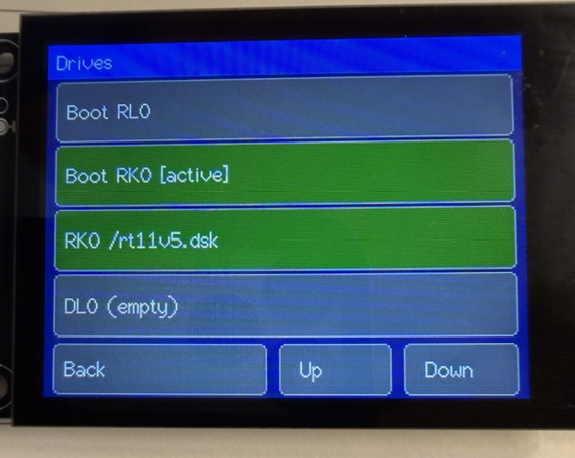
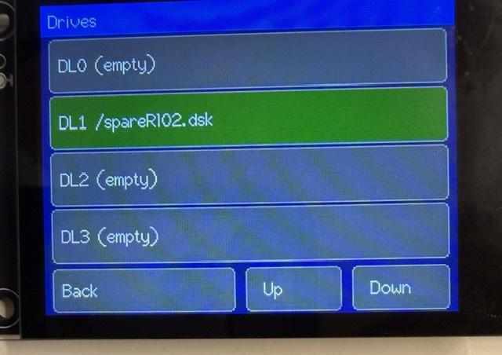
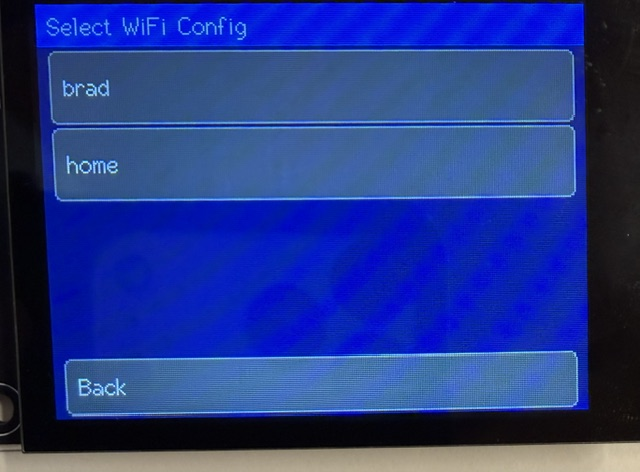
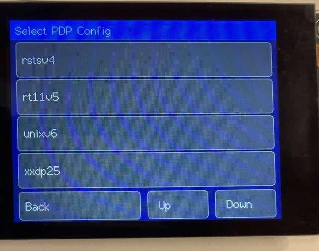
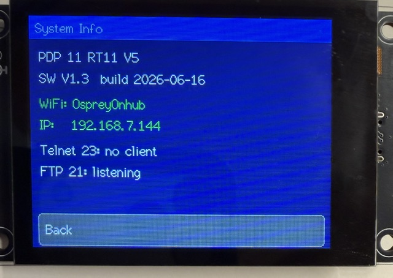

# PDP 11/40 Emulator User Guide

This guide covers the `vpdp1140` emulator for the Freenove ESP32-S3 2.8"
Display board. It describes the emulated PDP-11/40 system, SD card files,
network services, configuration files, and on-device menus.

## Overview

`vpdp1140` emulates a Digital Equipment Corporation PDP-11/40 on an ESP32-S3
board with a TFT display, capacitive touch, microSD storage, WiFi, Telnet, and
FTP.

The emulator can boot and run several PDP-11 operating systems from disk image
files stored on the SD card. The PDP-11 console is available on the TFT screen,
USB serial, and Telnet at the same time.


## Emulated Hardware

| Component | Emulation |
| --- | --- |
| CPU | PDP-11/40 KD11 core |
| Memory | 256 KB address space minus the 8 KB I/O page, giving 248 KB RAM |
| MMU | KT11-D style 18-bit mapping |
| Console | KL11 console at `0177560`, vector `060` |
| RK disk | RK11 controller for RK05 images |
| RL disk | RL11 controller, up to two normal RL drives in common configurations, with four host slots available as `DL0`..`DL3` |
| RP disk | Optional secondary RH11/RP04-RP06 disk as `RP0`; testing mode, not verified yet, and not currently bootable |
| Clocks | KW11-L line clock and optional KW11-P programmable clock |
| Boot ROM | M9312-style boot stubs for RK0 and RL0 |

The current memory model is sized for the PDP-11/40 18-bit physical address
space. The top 8 KB is the UNIBUS I/O page, so usable RAM is 248 KB.

## Supported Operating Systems

These systems boot with this release:

| System | Typical media | Status |
| --- | --- | --- |
| RT-11 V5 | RK05 | Boots to the `.` prompt and runs `DIR` |
| RSTS V4B | RK05 | Boots to the `READY` prompt |
| UNIX V6 | RK05 | Boots from `@` to the `#` shell |
| XXDP V2.2 | RL02 | Boots the XXDP monitor |
| XXDP V2.5 | RL02 | Boots the XXDP monitor |

Other PDP-11 operating systems may probe hardware that is incomplete,
configured differently, or intentionally disabled for compatibility. RSTS/E V7
and larger UNIX systems are useful bring-up targets, but may need different
compatibility settings and more complete MMU/device behavior.

## SD Card

Use a microSD card of up to 32 GB. The firmware stores configuration files and
PDP-11 disk images in the SD card root.

Typical root layout:

```text
/wificonfig.ini
/pdpconfig.ini
/wificonfig-home.ini
/pdpconfig-rt11.ini
/unixv6.dsk
/rt11v5.dsk
/rsts4b.dsk
/xxdp25.dsk
```

Disk images may use extensions such as `.dsk`, `.hdd`, `.img`, or `.ima`.
The on-device drive picker scans the SD root for those extensions.

## Configuration Files

The emulator uses two main initialization files:

| File | Purpose |
| --- | --- |
| `/wificonfig.ini` | WiFi credentials plus Telnet and FTP settings |
| `/pdpconfig.ini` | PDP-11 emulator title, boot input, diagnostics, compatibility, and disk image settings |

If either file is missing, the firmware writes a default file to the SD card.

Lines beginning with `;` or `#` are comments. Inline comments after values are
also accepted unless the comment character is inside quotes.

### Config Variants

You can keep multiple named configuration variants on the SD card:

```text
/wificonfig-home.ini
/wificonfig-shop.ini
/pdpconfig-rsts4b.ini
/pdpconfig-rt11.ini
/pdpconfig-unixv6.ini
```

The settings menu can select a variant and copy it over the active file:

| Variant type | Active file | Variant filename pattern |
| --- | --- | --- |
| WiFi | `/wificonfig.ini` | `wificonfig-NAME.ini` |
| PDP | `/pdpconfig.ini` | `pdpconfig-NAME.ini` |

After selecting a variant, the firmware asks whether to reset the ESP32 so the
new configuration can take effect.

## `/wificonfig.ini`

Example:

```ini
[wifi]
ssid     = YourNetwork
password = YourPassword
hostname = vpdp1140

[telnet]
enabled = true
port    = 23

[ftp]
enabled  = true
port     = 21
user     = esp32
password = esp32
```

### `[wifi]`

| Key | Values | Description |
| --- | --- | --- |
| `ssid` | Text | WiFi network name. If blank, compiled defaults from `secrets.h` are used. |
| `password` | Text | WiFi password. If blank, compiled defaults from `secrets.h` are used. |
| `hostname` | Text | Hostname advertised by the ESP32. |

### `[telnet]`

| Key | Values | Description |
| --- | --- | --- |
| `enabled` | `true`, `false`, `1`, `0`, `yes`, `no`, `on`, `off` | Enables the Telnet listener. |
| `port` | Number | Telnet TCP port. Default is `23`. |

The Telnet server is connected directly to the PDP-11 console. A Telnet client
sees the same console stream shown on the TFT.

### `[ftp]`

| Key | Values | Description |
| --- | --- | --- |
| `enabled` | Boolean | Enables the FTP server. |
| `port` | Number | FTP control port. Passive data uses `port + 1`. |
| `user` | Text | FTP username. |
| `password` | Text | FTP password. |

FTP exposes the SD card root for remote file management. Mounted disk images
are protected from destructive FTP access while in use.

## `/pdpconfig.ini`

Example:

```ini
[system]
title = PDP 11/40

[console]
boot_input = ""

[diag]
pcping      = 5
serialdelay = 20
trace       = false
v4b_quirks  = true
kwp_enabled = false

[disks]
dl0 = /xxdp25.dsk
dl1 =
dl2 =
dl3 =
rk0 = /unixv6.dsk
rp0 =
rp0_type = rp06
boot = rk0
```

### `[system]`

| Key | Values | Description |
| --- | --- | --- |
| `title` | Text | Title shown on the status line and System Info screen. |

Firmware version and build date are source-owned constants, not configuration
file keys.

### `[console]`

| Key | Values | Description |
| --- | --- | --- |
| `boot_input` | Quoted escaped text | Bytes injected into the KL11 input queue after each PDP-11 boot or reset. |

Accepted aliases for compatibility are `typeahead` and `boot_keys`, but
`boot_input` is the canonical key.

Supported escapes:

| Escape | Meaning |
| --- | --- |
| `\r` | Carriage return |
| `\n` | Line feed |
| `\t` | Tab |
| `\b` | Backspace |
| `\f` | Form feed |
| `\e` | Escape, `0x1B` |
| `\s` | Space |
| `\\` | Literal backslash |
| `\"` | Literal double quote |
| `\'` | Literal single quote |
| `\xHH` | Hex byte |
| `\ooo` | Octal byte, up to three octal digits |
| `^C` | Control-C |
| `^[` | Escape |
| `^?` | Delete, `0x7F` |

Examples:

```ini
boot_input = "unix\r"
boot_input = "^CSTART\r"
boot_input = "\x03START\r"
```

### `[diag]`

| Key | Values | Description |
| --- | --- | --- |
| `pcping` | Seconds | Interval for periodic PC/register dump to USB serial. `0` disables. |
| `serialdelay` | Milliseconds | Minimum host delay between successive console input bytes. Helps line-buffered hosts avoid overrunning KL11 receive handling. |
| `trace` | Boolean | Enables expensive per-instruction panic trace capture. Use only for debugging. |
| `v4b_quirks` | Boolean | Absorbs selected missing-device probes for RSTS/E V4B compatibility. Default `true`. |
| `kwp_enabled` | Boolean | Enables KW11-P programmable clock emulation. Default `false`. |

`v4b_quirks = true` is the normal compatibility setting for RSTS/E V4B, RT-11,
UNIX V6, and XXDP. Set it to `false` only when experimenting with systems that
are confused by the compatibility probe absorbs.

`kwp_enabled = true` enables CSR/CSB/CNTR behavior for the KW11-P programmable
clock at `0172540`. Some OS hardware tests require this; some older systems are
more stable with the default stub behavior.

The legacy section name `[emu]` is accepted as an alias for `[diag]`, but new
config files should use `[diag]`.

### `[disks]`

| Key | Values | Description |
| --- | --- | --- |
| `dl0` | SD path or blank | RL11 unit DL0 image. |
| `dl1` | SD path or blank | RL11 unit DL1 image. |
| `dl2` | SD path or blank | RL11 unit DL2 image. |
| `dl3` | SD path or blank | RL11 unit DL3 image. |
| `rk0` | SD path or blank | RK05 image used when booting RK0. |
| `rp0` | SD path or blank | Optional secondary RP-family image. |
| `rp0_type` | `rp04`, `rp05`, `rp06` | Geometry reported for RP0. |
| `boot` | `dl0`, `dl1`, `dl2`, `dl3`, `rk0`, `dk0`, `0`..`3`, `a`..`d` | Boot controller and unit. |

`rk0` and `dk0` are treated as the same boot target. `dk0` is useful when
thinking in UNIX V6 naming.

When `boot = rk0`, the RK image replaces host slot 0 so the RK11 controller sees
it as RK drive 0. When booting RL, slots map to `DL0` through `DL3`.

`rp0` is secondary storage in this build. RP0 support is in testing mode and has
not been verified yet. The boot ROM and menu boot choices are for RK0 and RL0.

## Disk Images

The firmware stores disk images as regular files on the SD card. The drive
picker only looks in the SD card root.

Common image sizes:

| Media | Approximate size | Notes |
| --- | --- | --- |
| RK05 | 2.5 MB | Used by RT-11, UNIX V6, RSTS/E V4B images |
| RK05 pair/combined images | About 5 MB | Some distributions use paired packs |
| RL01 | 5 MB | RL11-compatible removable disk pack |
| RL02 | 10 MB | Common XXDP and RSTS media |
| RP04/RP05/RP06 | Larger | Optional secondary RH11/RP disk image |

## Booting

### Boot From RK0

Set `/pdpconfig.ini`:

```ini
[disks]
rk0 = /unixv6.dsk
boot = rk0
```

The emulator installs the RK boot stub and mounts `rk0` as RK drive 0.

### Boot From RL0

Set `/pdpconfig.ini`:

```ini
[disks]
dl0 = /xxdp25.dsk
boot = dl0
```

The emulator installs the RL boot stub and boots from DL0.

### Startup Console Input

Use `boot_input` to type the first boot command automatically. For example,
UNIX V6 can be started with:

```ini
[console]
boot_input = "unix\r"
```

## Network Services

### WiFi Status

The status line shows the assigned IP address when connected, or a disconnected
state when WiFi is down.

### Telnet

Telnet connects to the KL11 console. Use:

```text
telnet <board-ip> 23
```

The status pill is:

| State | Meaning |
| --- | --- |
| Dim/off | Telnet is not listening |
| Green | Telnet listener is active |
| Yellow | A Telnet client is connected |

### FTP

FTP exposes the SD card root:

```text
ftp <board-ip> 21
```

Use the username and password from `[ftp]` in `/wificonfig.ini`.

The FTP status pill uses the same color convention as Telnet: dim/off when not
listening, green when listening, yellow when connected.

## On-Device Menus

Open the settings menu by tapping the screen or pressing the onboard button.
When the menu is open, PDP-11 execution is paused. FTP remains available.

The main menu is titled `PDP-11/40 Settings` and contains:



| Item | Action |
| --- | --- |
| `Drives` | Opens boot and disk-image mounting controls. |
| `WiFi Config` | Lists `wificonfig-NAME.ini` variants and copies the selected variant to `/wificonfig.ini`. |
| `PDP Config` | Lists `pdpconfig-NAME.ini` variants and copies the selected variant to `/pdpconfig.ini`. |
| `System Info` | Shows title, firmware version/build, WiFi/IP, Telnet status, and FTP status. |
| `Brightness` | Adjusts TFT backlight brightness. |
| `Reboot PDP-11` | Cold-boots the emulated PDP-11 without restarting the ESP32. |
| `Reset ESP32` | Opens a confirmation screen for a full ESP32 reset. |



The reboot and reset actions are shown in red because they interrupt the
running guest system.



### Drives Menu

The Drives menu includes:



| Item | Action |
| --- | --- |
| `Boot RL0` | Selects the RL boot path. |
| `Boot RK0` | Selects the RK boot path. |
| `RK0 ...` | Opens RK0 image mount/dismount controls. |
| `DL0 ...` through `DL3 ...` | Opens RL unit mount/dismount controls. |

Mounted drives are highlighted. Read-only mounted images are marked `[RO]`.



### Drive Screen

For an individual drive:

| Item | Action |
| --- | --- |
| `Mount Image` / `Change Image` | Opens the image picker. |
| `Dismount` | Removes the configured image from that drive. |

The image picker scans the SD root for `.dsk`, `.hdd`, `.img`, and `.ima`
files.

### Config Variant Menus

`WiFi Config` and `PDP Config` show up to 16 variants each. Selecting one opens
an `Apply: NAME` confirmation screen:





| Item | Action |
| --- | --- |
| `Yes, copy` | Copies the selected variant over the active config file. |
| `Cancel` | Returns to the main menu. |

After copying, the firmware asks `Reset ESP32 now?`.

### System Info

The System Info screen shows:



- Configured system title
- Firmware version and build date
- WiFi SSID or disconnected state
- IP address when connected
- Telnet enabled/listening/client state
- FTP enabled/listening/client state

### Brightness

The Brightness menu has:

| Item | Action |
| --- | --- |
| `- Dimmer` | Reduces TFT brightness. |
| `+ Brighter` | Increases TFT brightness. |

## Status Line

The bottom status area shows:

- Drive activity and mounted state
- WiFi IP address or disconnected state
- Telnet pill
- FTP pill
- Current emulation speed in MIPS
- Configured system title

## Troubleshooting

### The board writes default config files

If `/wificonfig.ini` or `/pdpconfig.ini` is missing, the firmware creates a
default. Edit the generated file or copy in a named variant.

### Telnet does not connect

Check:

- WiFi is connected and an IP address is shown.
- `[telnet] enabled = true`.
- The port matches the client command.
- No other client is already connected.

### FTP does not connect

Check:

- WiFi is connected.
- `[ftp] enabled = true`.
- Username/password match.
- Passive data port `port + 1` is allowed by the client/network.

### A disk image will not mount

Check:

- The image is in the SD card root if using the on-device picker.
- The extension is `.dsk`, `.hdd`, `.img`, or `.ima`.
- The image size is plausible for the selected controller.
- The image is not being modified over FTP while mounted.

### Guest OS reports missing or broken hardware

Some PDP-11 operating systems probe devices that this emulator does not fully
implement. Check `[diag] v4b_quirks` and `[diag] kwp_enabled`, and verify that
the boot disk image matches the selected controller.

## Credits

The PDP-11 CPU core descends from `sam11` by Chloe Lunn and earlier PDP-11
emulator work. The ESP32 host shell, menu pattern, SD storage, Telnet, FTP, and
touch UI are shared with the related ESP32 emulator projects in this workspace.
